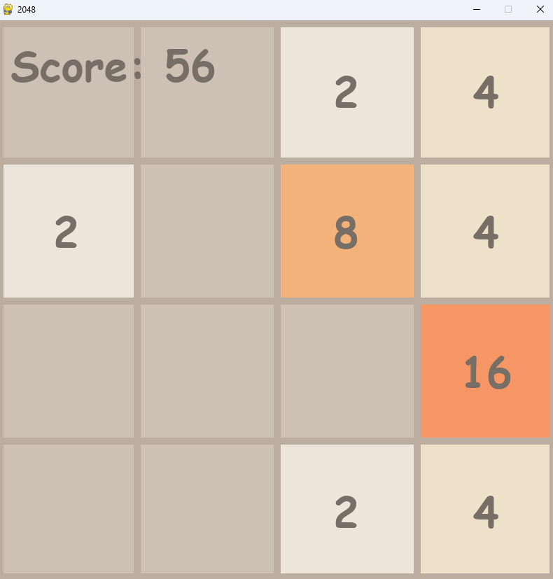
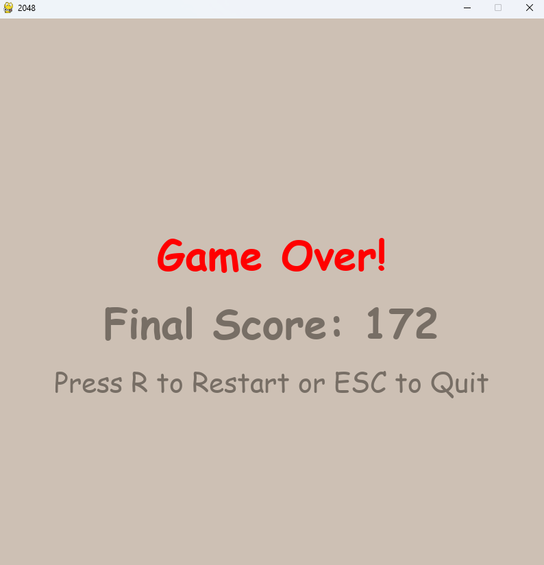

# 🧩 2048 Game in Python using Pygame

A classic recreation of the 2048 puzzle game built with **Python** and **Pygame**. Enjoy sliding tiles, merging numbers, and chasing that magical 2048 tile—all with smooth animations and a clean interface.

---

## 🎮 Gameplay Overview

- Use your **arrow keys** to slide numbered tiles on a 4x4 grid.
- When two tiles with the same number touch, they **merge into one** with double the value.
- Your goal is to create a tile with the number **2048**.
- The game ends when there are no valid moves left.

---

## ✨ Features

✅ Smooth tile animations  
✅ Real-time score tracking  
✅ Game Over screen with final score  
✅ Restart (`R`) or Quit (`Esc`) from the Game Over screen  
✅ Uses Object-Oriented Programming principles  

---

## 📸 Screenshots

> You can add your own screenshots by placing `.png` images in a folder called `assets/` and referencing them below.

| Game Screen              | Game Over Screen         |
|--------------------------|--------------------------|
|  |  |

---

## 🛠️ Technologies Used

- **Python 3.x**
- **Pygame** for game rendering and input handling
- **Procedural Programming**
- **Math** and **random** libraries for logic and generation

---
## Controls

| Key               | Action           |
| ----------------- | ---------------- |
| ⬅️ / ➡️ / ⬆️ / ⬇️ | Move tiles       |
| `R`               | Restart the game |
| `Esc`             | Exit the game    |

